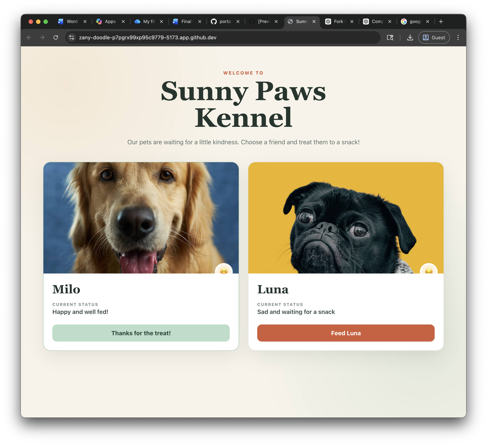

# Sunny Paws Pet Kennel

Sunny Paws is a small interactive React app built to demonstrate class components, parent-managed state, props, callback functions, and rendering lists with `.map()`. Each pet begins sad and hungry. Feeding one pet updates only that pet's picture and status.

## Features

- Two independently interactive pet cards
- A different sad and happy photograph for every pet
- State stored and updated in the class-based parent component
- Responsive, accessible card layout with clear mood and status feedback

## Installation

### Prerequisites

- Node.js 18 or newer
- npm

### Set up locally

```bash
git clone <your-fork-url>
cd petKennel
npm install
npm run dev
```

Open the local address printed by Vite (normally `http://localhost:5173`).

## Usage

1. Start the development server with `npm run dev`.
2. Find Milo and Luna in the kennel. Both initially have a sad status.
3. Select **Feed Milo** or **Feed Luna** on the corresponding card.
4. The selected pet changes to a happy photograph and its status becomes **Happy and well fed!**. The other pet remains unchanged.

To create a production build, run `npm run build`. To inspect that build locally, run `npm run preview`.

## Screenshot

The screenshot below shows Milo after being fed while Luna remains sad, demonstrating that each pet's state updates independently.



## How the React data flow works

`App` initializes its state with `initialData`, maps the pets to `ChildComponent` cards, and passes each card data plus the `handleFeedPet` callback. A child calls that callback with its own pet ID. The parent then uses `setState()` and `.map()` to create a new pets array in which only the matching pet is updated.

## Docker

```bash
docker-compose up --build
```

Visit `http://localhost:3000`. Stop and remove the container with `docker-compose down`.

## Technologies Used

- React 19
- JavaScript (ES modules and JSX)
- CSS
- Vite 7
- ESLint 9
- Docker and Docker Compose (optional)

## AI Contribution

The required disclosure and reflection are in [AI_CONTRIBUTION.md](AI_CONTRIBUTION.md).

## License

This project is available under the [MIT License](https://choosealicense.com/licenses/mit/).
